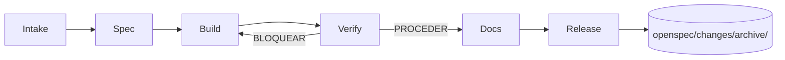

<!-- generated from .agents/ — do not edit manually -->
<!-- source-hash: 26ee0120977c -->
---
name: spec-build-verify
kind: canonical
title: OpenSpec Lifecycle (canonical)
description: >-
  Ciclo maestro OpenSpec: intake → proposal → design → tasks → spec →
  implementación → tests → docs → archive.
uses_agents: [spec, build, verify, docs, release]
---

# Workflow: spec-build-verify (canónico)

Es el único workflow que **todos** los cambios del proyecto deben seguir. Los workflows de negocio (`create-visual-agenda`, etc.) son especializaciones de este.

## Fases

### 1. Spec (agente `spec`)
- Prompt: `/new-spec <id> <title> <problem>`
- Salida: 4 archivos en `openspec/changes/<id>-<slug>/`.
- Gate check: license, privacy, human_review documentados.

### 2. Build (agente `build`)
- Prompt: `/implement-task <id> <task>` (una task cada vez).
- Iterar hasta cerrar todas las tareas de fases A–E.
- Cada task deja código + tests + docs si aplica.

### 3. Verify (agente `verify`)
- Prompt: `/verify-change <id>`.
- Ejecutar tests, lint, typecheck, a11y-audit, compliance-scan.
- Dictamen: PROCEDER o BLOQUEAR.

### 4. Docs (agente `docs`)
- Actualizar README, manuales, release notes.
- Consultar personas de doc + easy-reading + ux-accessibility.

### 5. Release (agente `release`)
- Prompt: `/archive-change <id>`.
- Mover a `openspec/changes/archive/`.
- Regenerar packs si tocaste `.agents/`.
- Publicar release notes.

## Diagrama

## Regla de oro

> Si una task no tiene spec, no se implementa. Si algo entra en conflicto con compliance, gana compliance.

## Ver también

- Agentes: [`spec`](../agents/spec.agent.md), [`build`](../agents/build.agent.md), [`verify`](../agents/verify.agent.md), [`docs`](../agents/docs.agent.md), [`release`](../agents/release.agent.md)
- Gates: [`mandatory-gates`](../rules/mandatory-gates.md)
