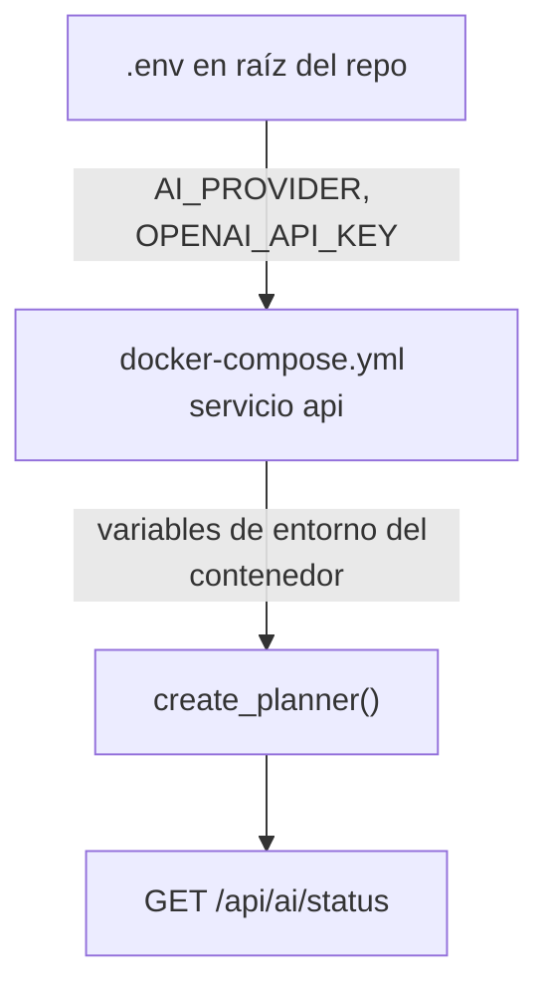

# Activar la capa IA (OpenAI)

## Diagnóstico

El endpoint [`/api/ai/status`](http://localhost:8000/api/ai/status) refleja el estado de `create_planner()` en [`services/api/src/arasaac_platform/ai/provider.py`](services/api/src/arasaac_platform/ai/provider.py):

```147:166:services/api/src/arasaac_platform/ai/provider.py
def create_planner(environ: dict[str, str] | None = None) -> AIPlanner:
    env = os.environ if environ is None else environ
    provider = env.get("AI_PROVIDER", "disabled").strip().lower()
    if provider != "openai":
        reason = (
            "La capa IA está desactivada."
            if provider == "disabled"
            else "AI_PROVIDER no está permitido."
        )
        return UnavailablePlanner(provider=provider or "disabled", reason=reason)

    api_key = env.get("OPENAI_API_KEY", "").strip()
    if not api_key:
        return UnavailablePlanner(
            provider="openai",
            reason="Falta OPENAI_API_KEY en el entorno del servidor.",
        )
```

**La clave API sola no basta.** El diseño (OpenSpec `0021-governed-ai-assistant`) exige dos condiciones:

| Variable | Valor actual en tu [`.env`](.env) | Valor requerido |
|----------|-----------------------------------|-----------------|
| `AI_PROVIDER` | `disabled` | `openai` |
| `OPENAI_API_KEY` | configurada | cualquier clave válida |

Por eso la respuesta es exactamente la que ves: `provider: "disabled"` y `reason: "La capa IA está desactivada."`

## Flujo de configuración



Con [`make start`](Makefile), Docker Compose inyecta las variables desde `.env`:

```25:30:docker-compose.yml
    environment:
      DATABASE_URL: postgresql+psycopg://arasaac:local-development-only@db:5432/arasaac_mvp
      AI_PROVIDER: ${AI_PROVIDER:-disabled}
      OPENAI_API_KEY: ${OPENAI_API_KEY:-}
      OPENAI_MODEL: ${OPENAI_MODEL:-gpt-5.4-mini}
      AI_TIMEOUT_SECONDS: ${AI_TIMEOUT_SECONDS:-20}
```

## Pasos para corregirlo

### 1. Editar `.env` en la raíz del proyecto

Cambiar esta línea:

```dotenv
AI_PROVIDER=disabled
```

por:

```dotenv
AI_PROVIDER=openai
```

Mantener el resto como está (`OPENAI_API_KEY`, `OPENAI_MODEL=gpt-5.4-mini`, etc.). El [README](README.md) documenta exactamente este flujo en la sección "Activar la capa IA".

### 2. Reiniciar el servicio API

Las variables se leen al arrancar el contenedor. Además, `get_ai_planner()` está cacheado con `@lru_cache` en [`services/api/src/arasaac_platform/api/ai.py`](services/api/src/arasaac_platform/api/ai.py), así que un simple reload sin reinicio no bastaría.

```bash
make stop && make start
```

O, si solo quieres recrear el contenedor API:

```bash
docker compose up -d --force-recreate api
```

### 3. Verificar

Tras el reinicio, `GET http://localhost:8000/api/ai/status` debería devolver algo como:

```json
{
  "available": true,
  "provider": "openai",
  "model": "gpt-5.4-mini",
  "reason": null,
  "generates_pictograms": false,
  "requires_human_selection": true,
  "stores_input": false
}
```

Comprobar también que Docker recibió las variables (sin mostrar la clave):

```bash
docker compose exec api printenv AI_PROVIDER
```

Debe imprimir `openai`.

## Si sigue fallando tras el cambio

Posibles causas secundarias (en orden de probabilidad):

1. **`.env` editado pero contenedor no recreado** — repetir paso 2.
2. **API arrancada con `make dev-api` en lugar de Docker** — `dev-api` sí hace `source` de `.env`, pero también requiere reiniciar uvicorn tras cambiar variables.
3. **Clave vacía o con espacios** — el endpoint pasaría a `provider: "openai"` con `reason: "Falta OPENAI_API_KEY..."` (no es tu caso actual).
4. **Proveedor distinto de `openai`** — cualquier otro valor devuelve `"AI_PROVIDER no está permitido."` (solo `openai` está implementado).

## Nota de seguridad

Tu `.env` contiene una clave real. No la subas a Git (ya está en [`.gitignore`](.gitignore)), no la pegues en issues ni capturas, y considera rotarla si se ha expuesto en algún canal.

## ¿Hace falta cambiar código?

No. El comportamiento es intencional: la IA está **opt-in** por defecto (`AI_PROVIDER=disabled` en [`.env.example`](.env.example)) para que la demo manual funcione sin claves. Solo configuración y reinicio.

Opcional (fuera de alcance inmediato): mejorar UX detectando `OPENAI_API_KEY` presente con `AI_PROVIDER=disabled` y devolviendo un `reason` más explícito del tipo *"Tienes clave pero falta AI_PROVIDER=openai"*.
