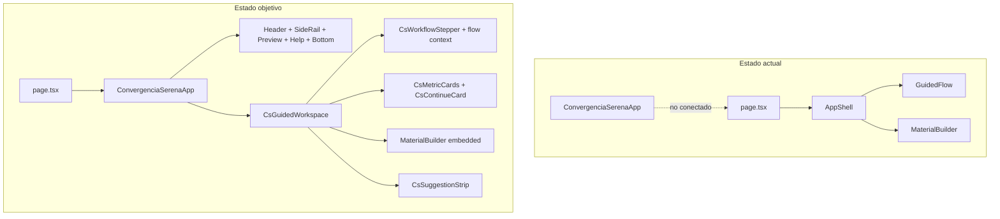

# Plan — OpenSpec 0026: Convergencia Serena pixel-perfect

## Diagnóstico del estado actual

La integración previa quedó a medias: **componentes y CSS existen pero la home sigue en el shell antiguo**.

| Área | Estado | Bloqueo |
|------|--------|---------|
| Shell CS | 11/13 componentes en [`apps/web/src/components/convergencia-serena/`](apps/web/src/components/convergencia-serena/) | Falta `CsContinueCard.tsx`, `CsThemeToggle`/`CsThemeScript`; `CsHeader` sin usuario ni tema |
| Entrada | [`apps/web/src/app/page.tsx`](apps/web/src/app/page.tsx) usa `AppShell` + `MaterialBuilder` | No monta `ConvergenciaSerenaApp` |
| CSS CS | [`theme.css`](apps/web/src/design-system/css/theme.css), [`layout.css`](apps/web/src/design-system/css/layout.css), [`components.css`](apps/web/src/design-system/css/components.css), [`responsive.css`](apps/web/src/design-system/css/responsive.css) | Solo se importa [`tokens.css`](apps/web/src/design-system/tokens.css) en [`styles.css`](apps/web/src/app/styles.css) |
| Assets | SVG en [`apps/web/assets/`](apps/web/assets/) | No hay [`apps/web/public/`](apps/web/public/); e2e de assets fallará en build |
| Builder | [`material-builder.tsx`](apps/web/src/features/material-builder/material-builder.tsx) con clases `.panel` / `.workspace` | Sigue pareciendo formulario administrativo |
| Stepper | [`CsWorkflowStepper`](apps/web/src/components/convergencia-serena/CsWorkflowStepper.tsx) estático | No usa `MaterialFlowContext` ni `aria-current="step"` (requerido por [`foundation.test.tsx`](apps/web/tests/unit/foundation.test.tsx) y [`status-page.spec.ts`](apps/web/tests/e2e/status-page.spec.ts)) |
| Dark theme | Ilustraciones con `prefers-color-scheme` en [`CsContextHelp`](apps/web/src/components/convergencia-serena/CsContextHelp.tsx) | Debe seguir `data-theme` del toggle, no media query del SO |
| Tests e2e | [`convergencia-serena.visual.spec.ts`](apps/web/tests/e2e/convergencia-serena.visual.spec.ts) parcial | Faltan capturas tablet/móvil y test axe; [`WEB-007`](apps/web/tests/e2e/status-page.spec.ts) asume 0 `` (incompatible con iconografía local) |



---

## Fase 1 — Infraestructura de assets y CSS

### 1.1 Servir assets locales

- Mantener fuente canónica en [`apps/web/assets/`](apps/web/assets/) (ya presente con `asset-manifest.json`).
- Añadir script de sincronización pre-build en [`apps/web/package.json`](apps/web/package.json):

```json
"prebuild": "node scripts/sync-cs-assets.mjs"
```

- El script copia `apps/web/assets/{brand,icons,illustrations,patterns}` → `apps/web/public/convergencia-serena/`.
- Verificar que [`convergencia-serena.assets.spec.ts`](apps/web/tests/e2e/convergencia-serena.assets.spec.ts) devuelve 200 para rutas `/convergencia-serena/...`.

### 1.2 Activar gramática visual CS

En [`apps/web/src/app/styles.css`](apps/web/src/app/styles.css), tras `tokens.css`, importar en orden:

```css
@import "../design-system/css/theme.css";
@import "../design-system/css/layout.css";
@import "../design-system/css/components.css";
@import "../design-system/css/responsive.css";
```

- Añadir reglas scoped bajo `.cs-root` para formularios embebidos (`.cs-root .workspace`, `.cs-root .panel` → apariencia `cs-panel`).
- Mantener estilos funcionales del builder (preview, review actions) pero anular look “admin form” dentro del shell.

---

## Fase 2 — Completar y conectar el shell

### 2.1 Cambiar punto de entrada

Reemplazar [`page.tsx`](apps/web/src/app/page.tsx):

```tsx
<MaterialFlowProvider>
  <ConvergenciaSerenaApp builder={<MaterialBuilder embedded />} />
</MaterialFlowProvider>
```

- `AppShell` deja de usarse en home (conservar archivo por si hay referencias de test unitario; actualizar [`app-shell.test.tsx`](apps/web/tests/unit/app-shell.test.tsx) si aplica).

### 2.2 Componentes faltantes

| Componente | Acción |
|------------|--------|
| **`CsContinueCard.tsx`** | Extraer la tercera tarjeta de [`CsMetricCards`](apps/web/src/components/convergencia-serena/CsMetricCards.tsx); ilustración theme-aware (`landscape-light` / `landscape-dark` según `data-theme`) |
| **`CsThemeToggle.tsx`** | Adaptar lógica de [`theme-toggle.tsx`](apps/web/src/components/theme-toggle.tsx) con iconos `sun`/`moon` de `CsIcon`, clases `cs-button`, `aria-pressed`, labels existentes para no romper e2e |
| **`CsThemeScript`** (opcional) | Extraer script de [`layout.tsx`](apps/web/src/app/layout.tsx) a módulo reutilizable; layout lo importa sin cambiar comportamiento |

### 2.3 Completar `CsHeader`

En [`CsHeader.tsx`](apps/web/src/components/convergencia-serena/CsHeader.tsx):

- Añadir zona de usuario (avatar con `CsIcon name="user"`, label accesible).
- Integrar `CsThemeToggle`.
- Mantener búsqueda, badges WCAG/teclado/contraste.
- Marcar `data-cs="header"` (ya presente).

### 2.4 Stepper dinámico gobernado

Convertir [`CsWorkflowStepper`](apps/web/src/components/convergencia-serena/CsWorkflowStepper.tsx) en client component:

- Consumir `useMaterialFlow()` de [`flow-context.tsx`](apps/web/src/features/material-builder/flow-context.tsx).
- Mapear fases del contexto a los 5 pasos del diseño (Definir → Compartir).
- En el paso activo: `aria-current="step"` en el `<li>` (sustituye rol de [`guided-flow.tsx`](apps/web/src/components/guided-flow.tsx) en home).
- Chip “Fase activa” en [`CsGuidedWorkspace`](apps/web/src/components/convergencia-serena/CsGuidedWorkspace.tsx) sincronizado con `phase`.
- `GuidedFlow` puede quedar como módulo interno o deprecarse en home; conservar test unitario reutilizando lógica compartida.

### 2.5 Atribución y landmarks

- Añadir `<footer className="cs-footer">` en [`ConvergenciaSerenaApp`](apps/web/src/components/convergencia-serena/ConvergenciaSerenaApp.tsx) con texto ARASAAC (Sergio Palao, Gobierno de Aragón, CC BY-NC-SA) — requerido por e2e.
- Verificar landmarks: un solo `<main>`, `<header>`, `<nav>`, `<aside>`, `<footer>`.
- Skip link → `#cs-main` (ya presente).

### 2.6 Dark theme real

- Sustituir `<picture media="(prefers-color-scheme: dark)">` por variantes controladas por `[data-theme="dark"]` (CSS `content`/`background-image` o componente client que lee `dataset.theme`).
- Confirmar tokens dark en [`theme.css`](apps/web/src/design-system/css/theme.css): fondos midnight/graphite, acentos sage/cyan, sin `filter: invert()`.

---

## Fase 3 — MaterialBuilder embebido (sin romper gobernanza)

### 3.1 Variante `embedded`

En [`material-builder.tsx`](apps/web/src/features/material-builder/material-builder.tsx):

```tsx
export function MaterialBuilder({ embedded = false }: { embedded?: boolean }) {
  const rootClass = embedded ? "cs-builder-embedded" : "workspace";
  // ...
}
```

### 3.2 Migración visual de paneles

Refactorizar clases en:

- [`creation-form.tsx`](apps/web/src/features/material-builder/creation-form.tsx) — config + búsqueda ARASAAC + IA (solo texto)
- [`editor-panel.tsx`](apps/web/src/features/material-builder/editor-panel.tsx) — preview editable
- [`review-panel.tsx`](apps/web/src/features/material-builder/review-panel.tsx) — revisión/exportación

Cambios:

| Antes | Después (embedded) |
|-------|-------------------|
| `className="panel"` | `className="cs-panel cs-builder-panel"` |
| `stepLabel` | `cs-eyebrow` |
| inputs/buttons globales | `cs-input`, `cs-button`, `cs-field`, `cs-chip` |
| Grid propio `.workspace` | `display: grid; gap` bajo `.cs-builder-embedded` sin competir con shell |

**Preservar sin cambios:**

- Llamadas API, estados, `useMaterialBuilder`.
- Export bloqueado si `status !== "approved"`.
- Atribución en preview ([`editor-panel.tsx`](apps/web/src/features/material-builder/editor-panel.tsx)).
- Avisos PII / no diagnóstico / selección humana.
- Pictogramas solo desde URLs ARASAAC reales tras selección.

### 3.3 Integración en workspace

En [`CsGuidedWorkspace`](apps/web/src/components/convergencia-serena/CsGuidedWorkspace.tsx):

```
Hero → Stepper → Métricas (2 cards) → CsContinueCard → Builder embebido → Sugerencias
```

- `CsMetricCards` queda con progreso + validación; `CsContinueCard` como componente independiente con `data-cs="continue-card"`.

---

## Fase 4 — Tests y validación

### 4.1 Ampliar regresión visual

Completar [`convergencia-serena.visual.spec.ts`](apps/web/tests/e2e/convergencia-serena.visual.spec.ts) según [`playwright-plan.md`](apps/web/src/design-system/visual-regression/playwright-plan.md):

- Desktop light/dark (1440×1000) — ya esbozado
- Tablet light/dark (768×1024)
- Mobile light/dark (390×844)
- Overflow horizontal en 390px
- Axe: 0 serious/critical (patrón de [`status-page.spec.ts`](apps/web/tests/e2e/status-page.spec.ts))

Generar snapshots baseline en primer run verde.

### 4.2 Ajustar tests en conflicto

| Test | Cambio |
|------|--------|
| `WEB-007` img count = 0 | Verificar ausencia de `img[src*="arasaac"]` en carga inicial; permitir SVG locales de `/convergencia-serena/` |
| `foundation.test.tsx` | Debe seguir pasando: `aria-current="step"`, headings del builder, Sergio Palao en footer |
| `app-shell.test.tsx` | Mantener test del componente aislado o redirigir a test de `ConvergenciaSerenaApp` |

### 4.3 Tests unitarios nuevos

- `ConvergenciaSerenaApp`: landmarks, skip link, `data-cs` zones.
- `CsWorkflowStepper`: fase activa con provider.
- `CsContinueCard`: render y CTA accesible.

### 4.4 Gates finales

```bash
make openspec-verify
make lint && make typecheck
npm --prefix apps/web run build
make test
```

### 4.5 Rúbrica visual ≥ 90/100

Evaluar contra [`acceptance-rubric.md`](apps/web/src/design-system/visual-regression/acceptance-rubric.md):

- Composición completa (header premium, side rail con estados, preview móvil desktop, help, bottom strip).
- Paletas light/dark semánticas.
- Builder integrado en cards, no formulario plano.
- Sin overflow móvil.

---

## Archivos principales a tocar

| Archivo | Cambio |
|---------|--------|
| [`apps/web/src/app/page.tsx`](apps/web/src/app/page.tsx) | Montar `ConvergenciaSerenaApp` |
| [`apps/web/src/app/styles.css`](apps/web/src/app/styles.css) | Importar CSS CS + overrides embebidos |
| [`apps/web/package.json`](apps/web/package.json) | Script `prebuild` sync assets |
| `apps/web/scripts/sync-cs-assets.mjs` | Nuevo |
| [`ConvergenciaSerenaApp.tsx`](apps/web/src/components/convergencia-serena/ConvergenciaSerenaApp.tsx) | Footer atribución |
| [`CsHeader.tsx`](apps/web/src/components/convergencia-serena/CsHeader.tsx) | Usuario + tema |
| [`CsWorkflowStepper.tsx`](apps/web/src/components/convergencia-serena/CsWorkflowStepper.tsx) | Client + flow context |
| `CsContinueCard.tsx`, `CsThemeToggle.tsx` | Nuevos |
| [`CsGuidedWorkspace.tsx`](apps/web/src/components/convergencia-serena/CsGuidedWorkspace.tsx) | Orquestación final |
| [`material-builder.tsx`](apps/web/src/features/material-builder/material-builder.tsx) + paneles | Variante embedded |
| [`convergencia-serena.visual.spec.ts`](apps/web/tests/e2e/convergencia-serena.visual.spec.ts) | Capturas completas + axe |
| [`status-page.spec.ts`](apps/web/tests/e2e/status-page.spec.ts) | WEB-007 ajustado |

---

## Guardrails (no negociables)

- IA solo propone texto/búsquedas; nunca genera pictogramas.
- Export solo con revisión humana aprobada.
- Atribución ARASAAC visible en footer y preview.
- Sin PII; avisos de privacidad preservados.
- WCAG 2.2 AA: foco visible, teclado, targets ≥ 44px, landmarks, axe limpio.
- No CDN externo para iconografía/marca.

## Orden de ejecución recomendado

1. Assets + CSS (desbloquea render visual)
2. Conectar shell en `page.tsx`
3. Completar componentes faltantes (header, continue card, stepper dinámico)
4. Embedded MaterialBuilder
5. Tests + snapshots + rúbrica
6. Marcar tasks en [`openspec/changes/0026-.../tasks.md`](openspec/changes/0026-frontend-component-contract-and-visual-regression/tasks.md) y archivar OpenSpec al verde
