# Plan de mejoras — ARASAAC Social MCP Platform

## Estado actual (resumen)

El repositorio es un **MVP-0 funcional y gobernado**: API FastAPI, web Next.js, MCP stdio, PostgreSQL en Docker, 19 OpenSpecs activas casi completas, CI con cobertura ≥75% y informe PASS ([`docs/testing/test-report-mvp0.md`](docs/testing/test-report-mvp0.md)). La deuda principal no es calidad de código sino **limpieza documental**, **huecos menores del MVP**, **frontend monolítico** y **capacidades futuras** sin implementar.

```mermaid
flowchart LR
  subgraph faseA [Fase A - Limpieza]
    A1[Duplicados iCloud]
    A2[OpenSpec archive]
    A3[Docs obsoletos]
  end
  subgraph faseE [Fase E - Frontend]
    E1[WCAG 2.2]
    E2[Refactor UI]
    E3[UX estados]
  end
  subgraph faseB [Fase B - MVP]
    B1[Tests huecos]
    B2[Smoke OpenAI]
    B3[Paridad dev]
  end
  subgraph faseD [Fase D - Plataforma]
    D1[Alembic]
    D2[Observabilidad]
    D3[pgvector prep]
  end
  subgraph faseC [Fase C - Release 2]
    C1[Generadores]
    C2[Export avanzado]
    C3[Preferencias]
  end
  faseA --> faseE --> faseB --> faseD --> faseC
```

---

## Fase A — Limpieza técnica y deuda documental

**Objetivo:** Repo limpio, fuente de verdad única, sin ruido que confunda a humanos ni agentes.

### A.1 Eliminar artefactos duplicados y conflictos de sync

- Borrar ~61 archivos no rastreados con sufijo ` 2.*` / ` 3.*` en [`.codex/agents/`](.codex/agents/) y [`docs/obsidian/agent-pack/`](docs/obsidian/agent-pack/).
- Borrar copias `.coverage 2`, `.coverage 3`, `.coverage 4` en raíz.
- Añadir a [`.gitignore`](.gitignore) patrones para conflictos iCloud/Dropbox: `* 2.md`, `* 3.md`, `* 2.toml`, `* 3.toml`, `.coverage *`.

### A.2 Consolidar documentación duplicada

- Resolver duplicidad entre [`openspec/changes/`](openspec/changes/) (activo) y [`openspec 2/changes/`](openspec%202/changes/) (copia histórica con 96 archivos).
  - **Decisión recomendada:** mover `openspec 2/` a `docs/archive/openspec-roadmap/` o eliminar si es idéntico al mapa en [`01_MAPA_OPENSPEC.md`](01_MAPA_OPENSPEC.md).
- Unificar referencias: raíz (`02_AGENTES_SKILLS_WORKFLOWS_V2.md`) vs canónico [`.agents/`](.agents/) — dejar en raíz solo un puntero al canónico.
- Marcar [`generate_files.py`](generate_files.py) como histórico en comentario/README interno o mover a `scripts/archive/`.

### A.3 Archivar OpenSpecs completadas

- Crear `openspec/changes/archive/` y mover las 19 changes MVP con todas las tasks `[x]`.
- Actualizar [`Makefile`](Makefile) target `openspec-verify` para validar solo changes activas (excluir `archive/`).
- Alinear conteo en [`docs/testing/test-report-mvp0.md`](docs/testing/test-report-mvp0.md) (cita 17; Makefile verifica 19).

### A.4 Corregir mensajes obsoletos "placeholder"

- [`Makefile`](Makefile) línea ~28: quitar referencia a "MCP placeholder".
- [`services/mcp/src/safe_mcp/__init__.py`](services/mcp/src/safe_mcp/__init__.py): actualizar docstring.
- [`apps/web/tests/e2e/service-contracts.spec.ts`](apps/web/tests/e2e/service-contracts.spec.ts): renombrar tests "placeholder" a nombres descriptivos.
- [`README.md`](README.md): aclarar explícitamente que MCP en Docker es **HTTP de estado** y el protocolo real es **stdio** (`make mcp-stdio`).

### A.5 Endurecer verificación de agent packs

- Incluir `make agent-packs-verify` en [`.github/workflows/quality.yml`](.github/workflows/quality.yml) (hoy solo en workflow path-filtered).
- Documentar en [`docs/agents/multi-ide-agent-packs.md`](docs/agents/multi-ide-agent-packs.md) el procedimiento post-sync y limpieza de obsoletos.

**Criterio de salida Fase A:** `git status` limpio, `make agent-packs-verify` y `make openspec-verify` pasan, sin duplicados `* 3.*` en el repo.

---

## Fase E — Frontend: refactor, accesibilidad WCAG 2.2 y UX

**Objetivo:** Mejorar mantenibilidad, cumplimiento AA real y experiencia de usuario sin romper contratos API.

### E.1 Accesibilidad WCAG 2.2

- Ampliar reglas axe en [`apps/web/tests/e2e/status-page.spec.ts`](apps/web/tests/e2e/status-page.spec.ts): añadir tags `wcag22aa` además de `wcag21aa`.
- Añadir `aria-busy={busy}` en contenedor principal de [`material-builder.tsx`](apps/web/src/app/material-builder.tsx) durante operaciones async.
- Corregir semántica: evitar `<aside>` anidado en [`app-shell.tsx`](apps/web/src/components/app-shell.tsx) — usar `div` con `role="complementary"` o reestructurar layout.
- Localizar estados de workflow (`draft`, `in_review`, `approved`, `rejected`) a español en UI.
- Añadir `error.tsx` y `loading.tsx` en [`apps/web/src/app/`](apps/web/src/app/).

### E.2 Flujo guiado dinámico

- Hacer [`guided-flow.tsx`](apps/web/src/components/guided-flow.tsx) reactivo al paso actual del usuario (no siempre `aria-current="step"` en fase 0).
- Sincronizar anclas hash (`#workspace`, `#preview-heading`) con progreso real.

### E.3 Tema y anti-flicker

- Implementar script inline en [`layout.tsx`](apps/web/src/app/layout.tsx) para aplicar tema antes del paint (evitar flash documentado en OpenSpec 0023).
- Test unitario de persistencia de tema en [`theme-toggle.test.tsx`](apps/web/tests/unit/theme-toggle.test.tsx).

### E.4 Refactor del constructor monolítico

- Dividir [`material-builder.tsx`](apps/web/src/app/material-builder.tsx) (~600 líneas) en módulos bajo `apps/web/src/features/material-builder/`:
  - `use-material-api.ts` (fetch/state)
  - `creation-form.tsx`, `editor-panel.tsx`, `review-panel.tsx`, `export-panel.tsx`
- Mantener `MaterialBuilder` como orquestador fino en `page.tsx`.

### E.5 Ampliar cobertura de tests frontend

- Extender [`vitest.config.ts`](apps/web/vitest.config.ts) para incluir `src/components/**`.
- Añadir tests unitarios para `guided-flow`, `app-shell` (skip link, landmarks).
- E2E: test de reordenación por teclado (Subir/Bajar/Eliminar) en bloques del editor.

### E.6 Design system (opcional dentro de fase)

- Evaluar extracción de `packages/ui/` referenciado en [`.cursor/rules/arasaac-frontend.mdc`](.cursor/rules/arasaac-frontend.mdc) — solo si el refactor E.4 lo justifica; reutilizar [`tokens.css`](apps/web/src/design-system/tokens.css).

**Criterio de salida Fase E:** axe con WCAG 2.2 sin violaciones críticas, `material-builder.tsx` <200 líneas en orquestador, vitest cubre componentes, estados localizados.

---

## Fase B — Cierre de huecos del MVP-0

**Objetivo:** Paridad dev/prod, tests completos y única task OpenSpec pendiente cerrada.

### B.1 Tests API faltantes

- Añadir en [`services/api/tests/`](services/api/tests/):
  - `POST /api/materials/boards`
  - `GET /api/materials` (listado)
  - `GET /api/materials/{id}/export?format=pdf`
  - Casos 404/409 adicionales en workflow
- Crear [`services/api/tests/conftest.py`](services/api/tests/conftest.py) con fixture que limpie `app.dependency_overrides` tras cada test.

### B.2 Refactor repositorio (testabilidad)

- Sustituir singleton en [`api/materials.py`](services/api/src/arasaac_platform/api/materials.py) (`repository = create_repository(...)`) por factory inyectada vía `Depends` — facilita tests y hot-reload.

### B.3 Paridad desarrollo local ↔ Docker

- Documentar en [`README.md`](README.md) que sin `DATABASE_URL` se usa memoria ([`repositories/__init__.py`](services/api/src/arasaac_platform/repositories/__init__.py)).
- Añadir target `make dev-db` o incluir Postgres en flujo dev con `.env.example` preconfigurado.
- Opcional: target `make dev` que lance API + MCP + web en un solo comando (process manager o `docker compose` parcial).

### B.4 Smoke OpenAI real (única task abierta)

- Ejecutar smoke documentado en [`openspec/changes/0021-governed-ai-assistant/tasks.md`](openspec/changes/0021-governed-ai-assistant/tasks.md) con clave efímera de runtime.
- Añadir test de integración opt-in (`OPENAI_LIVE_TEST=1`) en [`test_ai_provider.py`](services/api/tests/test_ai_provider.py) — no en CI por defecto.
- Marcar task `[x]` y documentar resultado en test-report.

### B.5 Calidad Python menor

- Declarar `pytest-anyio` explícitamente en [`services/api/pyproject.toml`](services/api/pyproject.toml).
- Endurecer Ruff: añadir `select = ["E","F","I","UP","B","ASYNC"]` en ambos `pyproject.toml`.

### B.6 MaterialType.SIGNAGE

- Decisión: o implementar endpoint mínimo en B (si se adelanta) o **retirar del enum** hasta Fase C — documentar en dominio para evitar confusión.

**Criterio de salida Fase B:** cobertura API de boards/list/export PDF, conftest activo, smoke OpenAI documentado, dev local puede usar Postgres con un comando.

---

## Fase D — Madurez de plataforma

**Objetivo:** Preparar el sistema para piloto institucional: persistencia versionada, observabilidad, seguridad operativa.

### D.1 Migraciones de base de datos

- Introducir Alembic en [`services/api/`](services/api/): reemplazar `Base.metadata.create_all()` en [`repositories/sql.py`](services/api/src/arasaac_platform/repositories/sql.py) por migraciones versionadas.
- Migración inicial: tablas `materials`, `audit_events` (esquema JSON actual).
- Script `make db-migrate` / `make db-upgrade` en Makefile.

### D.2 Tests de integración PostgreSQL

- Añadir servicio `db` en job CI o usar testcontainers para [`test_sql_repository.py`](services/api/tests/test_sql_repository.py) contra Postgres 17 (no solo SQLite).
- Validar healthcheck y persistencia post-restart como en Docker.

### D.3 Observabilidad

- Logging estructurado (JSON) en API y MCP con `request_id` correlacionado.
- Métricas mínimas: contadores de exportaciones, revisiones, tool calls MCP (Prometheus o endpoint `/metrics` interno).
- Ampliar audit log con eventos de IA (`ai_plan_requested`, `ai_plan_rejected_privacy`) si no están ya registrados.

### D.4 Seguridad operativa (pre-auth)

- Rate limiting en endpoints públicos (`/api/pictograms/search`, `/api/ai/plan`).
- CORS configurable por entorno (no hardcode solo `localhost:3000` en producción).
- Revisión de secretos: validar que `.env` nunca aparece en logs ([`ai/provider.py`](services/api/src/arasaac_platform/ai/provider.py)).

### D.5 Preparación pgvector (sin ranking completo)

- Extensión `vector` en [`docker-compose.yml`](docker-compose.yml).
- Tabla `pictogram_embeddings` con metadata ARASAAC (ID, label, embedding placeholder).
- OpenSpec nueva `0022-semantic-search-future` en `openspec/changes/` (no en archive) con diseño de indexación offline.

### D.6 MCP: documentación y evolución controlada

- Documentar en [`docs/architecture/`](docs/architecture/) el modelo dual HTTP-status / stdio-tools.
- Evaluar (no implementar aún) tools de materiales bajo gobernanza: schema + security review obligatorio según [`AGENTS.md`](AGENTS.md).

### D.7 Auth (Release 3 — diseño only en esta fase)

- OpenSpec `keycloak-future-auth` en changes activas con `design.md` y spike de integración — implementación real queda fuera de Fase D si no hay requisito de piloto con login.

**Criterio de salida Fase D:** migraciones Alembic en CI, test Postgres verde, logs estructurados, rate limit activo, extensión pgvector disponible en Docker.

---

## Fase C — Release 2: nuevos generadores y exportación

**Objetivo:** Ampliar tipos de material según [`01_MAPA_OPENSPEC.md`](01_MAPA_OPENSPEC.md) Release 2.

### C.1 OpenSpec por generador (flujo obligatorio)

Crear changes nuevas en `openspec/changes/` antes de código:

| ID | Generador | Archivos clave previstos |
|----|-----------|--------------------------|
| 0009 | Lectura fácil + pictos | `services/materials.py`, `api/materials.py`, UI |
| 0010 | Historias sociales | secuencia narrativa, validación coherencia |
| 0011 | Señalética | `MaterialType.SIGNAGE`, validación sin logo ARASAAC |
| 0018 | Preferencias sin PII | plantillas entidad, perfiles genéricos |

Cada una: `proposal.md`, `design.md`, `tasks.md`, `spec.md` + skills existentes en [`.agents/skills/`](.agents/skills/).

### C.2 Implementación backend por generador

- Endpoints REST paralelos a agendas/boards: `POST /api/materials/documents`, `/stories`, `/signage`.
- Reutilizar workflow existente ([`domain/workflow.py`](services/api/src/arasaac_platform/domain/workflow.py)) y export engine.
- Validadores de dominio: [`validate-sequence-coherence`](.agents/skills/validate-sequence-coherence/SKILL.md), [`validate-plain-language`](.agents/skills/validate-plain-language/SKILL.md), [`validate-visual-density`](.agents/skills/validate-visual-density/SKILL.md).

### C.3 Exportación avanzada

- DOCX: skill [`export-generate-docx`](.claude/skills/export-generate-docx/SKILL.md) → implementar en [`services/export.py`](services/api/src/arasaac_platform/services/export.py).
- PPTX y ZIP empaquetado con manifiesto ([`export-attach-manifest`](.claude/skills/export-attach-manifest/SKILL.md)).
- Mantener bloqueo de export hasta `status === approved` y atribución visible.

### C.4 Frontend Release 2

- Nuevos flujos en UI refactorizada (Fase E): selector de tipo de material ampliado.
- Preview específico por tipo (señalética: layout horizontal; historia social: secuencia numerada).

### C.5 Tests y DoD Release 2

- Tests unitarios por generador + E2E Playwright por flujo completo (crear → revisar → exportar).
- Actualizar [`docs/testing/test-plan-mvp0.md`](docs/testing/test-plan-mvp0.md) → `test-plan-release2.md`.
- Ejecutar `make test lint typecheck openspec-verify` antes de archivar changes.

### C.6 Dossier ARASAAC (0024)

- Generar dossier institucional con skill [`arasaac-validation-dossier`](.claude/skills/arasaac-validation-dossier/SKILL.md) para validación con ARASAAC/Gobierno de Aragón.

**Criterio de salida Fase C:** tres generadores operativos con revisión humana, export HTML/PDF/DOCX mínimo, preferencias sin PII, tests y OpenSpecs archivadas.

---

## Orden de ejecución y dependencias

| Fase | Depende de | Duración estimada |
|------|------------|-------------------|
| **A** Limpieza | — | 1–2 días |
| **E** Frontend | A (repo limpio) | 1–2 semanas |
| **B** MVP | A, parcialmente E (tests E2E estables) | 3–5 días |
| **D** Plataforma | B (tests sólidos) | 2–3 semanas |
| **C** Release 2 | E (UI modular), D (migraciones) | 3–4 semanas |

**Nota:** E antes de B permite refactorizar UI sin duplicar tests sobre el monolito; B puede empezar en paralelo con la cola E.4–E.6 si se coordinan interfaces.

---

## Riesgos y mitigaciones

- **Refactor frontend (E.4)** puede romper E2E → ejecutar Playwright tras cada extracción de componente.
- **Alembic (D.1)** en datos existentes → script de backup documentado (`make reset-data` solo dev).
- **Release 2 (C)** amplía superficie de cumplimiento licencia → cada generador debe pasar [`validate-license-notice-visible`](.claude/skills/validate-license-notice-visible/SKILL.md) y revisión humana obligatoria.
- **OpenAI smoke (B.4)** requiere clave efímera → nunca commitear; test opt-in fuera de CI.
