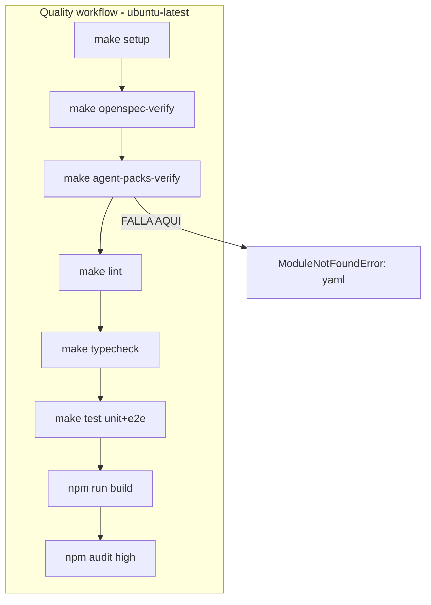
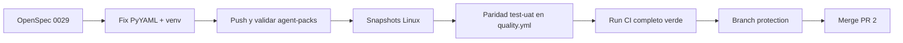

# Plan de reparación CI/CD GitHub Actions

## Diagnóstico de la auditoría

### Estado actual

| Workflow | Trigger | Estado reciente |
|----------|---------|-----------------|
| [`.github/workflows/quality.yml`](.github/workflows/quality.yml) | PR + push `main` | **Falla** (2 últimos runs) |
| [`.github/workflows/agent-packs.yml`](.github/workflows/agent-packs.yml) | PR/push path-filtered | Pasa |

- PR abierta: [#2](https://github.com/aislen404/ARASAAC_MCP/pull/2) (`codex/project-foundation`, DRAFT)
- Último run fallido: [28818041523](https://github.com/aislen404/ARASAAC_MCP/actions/runs/28818041523) en commit `c886ddb`
- Último run exitoso: [28789292054](https://github.com/aislen404/ARASAAC_MCP/actions/runs/28789292054) en commit `46e8f42` (antes de integrar `agent-packs-verify` en Quality)



### Causa raíz confirmada (P0)

En el commit [`a23c84e`](a23c84e) se añadió `make agent-packs-verify` a Quality, pero **no se instaló la dependencia `pyyaml`** que requiere [`scripts/sync_agent_packs.py`](scripts/sync_agent_packs.py):

```
ModuleNotFoundError: No module named 'yaml'
make: *** [Makefile:105: agent-packs-verify] Error 1
```

- [`agent-packs.yml`](.github/workflows/agent-packs.yml) sí hace `pip install pyyaml` (línea 48)
- [`quality.yml`](.github/workflows/quality.yml) ejecuta `make setup` + `agent-packs-verify` **sin** instalar `pyyaml`
- [`Makefile`](Makefile) líneas 104-105 invocan `python3` del sistema, no el venv
- `make setup` solo instala `services/api[dev]` y `services/mcp[dev]` — sin PyYAML

El fallo es **determinístico** y ocurre antes de lint, tests o build; por eso los 2 últimos runs fallan en ~1-2 min sin llegar a E2E.

### Riesgos secundarios detectados (P1-P2)

1. **Snapshots visuales solo macOS**: en [`apps/web/tests/e2e/convergencia-serena.visual.spec.ts-snapshots/`](apps/web/tests/e2e/convergencia-serena.visual.spec.ts-snapshots/) los archivos son `*-chromium-darwin.png`. CI corre en Linux y Playwright buscará `*-chromium-linux.png` → **fallo predecible** al superar el bloqueo de PyYAML (OpenSpec [`0026`](openspec/changes/0026-frontend-component-contract-and-visual-regression/spec.md) exige screenshots).

2. **Paridad CI vs UAT local incompleta**: [`make test-uat`](Makefile) incluye `docker compose config --quiet` y `npm audit --audit-level=low`; Quality solo hace `npm audit --audit-level=high` y no valida compose.

3. **Inconsistencia Python en scripts de packs**: `make setup` crea `.venv` pero `agent-packs-verify` usa `python3` del sistema → comportamiento distinto local/CI.

4. **Warnings Node.js 20**: GitHub Actions fuerza Node 24 en `actions/checkout@v4`, `setup-node@v4`, `setup-python@v5` (deprecación sep 2025).

5. **Sin branch protection**: `main` no tiene reglas que exijan Quality en verde antes de merge.

6. **Cambios locales sin commitear**: modificaciones en E2E, componentes Convergencia Serena y snapshots darwin que pueden introducir nuevos fallos al pushear.

7. **Tiempo de pipeline**: `make setup` descarga Chromium/FFmpeg de Playwright (~300 MB) en cada run; con 54 tests E2E y 3 servidores ([`playwright.config.ts`](apps/web/playwright.config.ts)), el timeout de 20 min puede quedar justo tras añadir gates.

---

## Fase 0 — OpenSpec obligatorio

Crear change `openspec/changes/0029-ci-quality-gate-repair/` con:

- **proposal.md**: reparar Quality tras integración de `agent-packs-verify`; alinear CI con `make test-uat`; snapshots visuales reproducibles en Linux.
- **design.md**: decisión de instalar PyYAML en `make setup` + usar `.venv/bin/python3` en targets de packs; estrategia de snapshots (generar en Linux via Docker); paridad de gates.
- **tasks.md**: tareas atómicas por fase (abajo).
- **spec.md**: escenarios verificables:
  - Quality pasa en PR sin `ModuleNotFoundError`
  - `agent-packs-verify` usa el mismo intérprete que el resto del pipeline
  - tests visuales pasan en `ubuntu-latest`
  - CI ejecuta los mismos gates que `make test-uat`
  - merge a `main` requiere Quality en verde

---

## Fase 1 — Desbloqueo inmediato (P0)

### 1.1 Unificar dependencia PyYAML

**Archivo principal**: [`Makefile`](Makefile)

```makefile
setup:
	python3 -m venv .venv
	.venv/bin/pip install -e "services/api[dev]" -e "services/mcp[dev]" pyyaml
	# ... resto igual

agent-packs-sync:
	.venv/bin/python3 scripts/sync_agent_packs.py

agent-packs-verify:
	.venv/bin/python3 scripts/verify_agent_packs_sync.py
```

**Archivo secundario**: [`.github/workflows/quality.yml`](.github/workflows/quality.yml) — añadir paso defensivo tras setup (belt-and-suspenders):

```yaml
- name: Verify agent-pack tooling
  run: .venv/bin/python3 -c "import yaml"
```

### 1.2 Simplificar `agent-packs.yml`

Reutilizar el mismo contrato: o bien `make agent-packs-verify` (con venv ya creado por un mini-setup), o instalar pyyaml en venv en lugar de pip global suelto. Evitar dos formas distintas de instalar la misma dependencia.

### 1.3 Verificación

```bash
make setup
make agent-packs-verify   # debe pasar sin yaml error
make openspec-verify
```

Push a `codex/project-foundation` y confirmar que Quality supera el paso "Agent packs".

---

## Fase 2 — Snapshots visuales reproducibles en Linux (P1)

### 2.1 Regenerar snapshots en entorno Linux

Los snapshots actuales son macOS-only (`*-chromium-darwin.png`). Opciones (recomendada: **A**):

- **A (recomendada)**: Regenerar en contenedor Linux con la misma versión de Playwright del proyecto:

```bash
docker run --rm -v "$PWD":/work -w /work/apps/web \
  mcr.microsoft.com/playwright:v1.61.1-jammy \
  bash -c "npm ci && npx playwright test convergencia-serena.visual.spec.ts --update-snapshots"
```

- **B**: Añadir `snapshotPathTemplate` en [`playwright.config.ts`](apps/web/playwright.config.ts) para nombres sin sufijo de OS — solo si se valida que el render es estable cross-platform (riesgo de flakiness).

### 2.2 Commitear snapshots Linux

Tras regenerar, el repo debe contener `*-chromium-linux.png` (o el template acordado). Eliminar snapshots darwin obsoletos si ya no aplican.

### 2.3 Documentar en [`docs/testing/test-plan-mvp0.md`](docs/testing/test-plan-mvp0.md)

Añadir nota: "Los snapshots visuales deben generarse en Linux (CI) o vía contenedor Playwright oficial; no commitear solo snapshots darwin."

---

## Fase 3 — Paridad total con `make test-uat` (P1)

Actualizar [`.github/workflows/quality.yml`](.github/workflows/quality.yml) para reflejar exactamente [`make test-uat`](Makefile):

| Gate | Hoy en Quality | En test-uat | Acción |
|------|----------------|-------------|--------|
| lint | sí | sí | OK |
| typecheck | sí | sí | OK |
| test-unit | sí | sí | OK |
| test-e2e | sí | sí | OK |
| openspec-verify | sí | sí | OK |
| agent-packs-verify | sí (roto) | sí | reparar Fase 1 |
| build | sí | sí | OK |
| npm audit | `--audit-level=high` | `--audit-level=low` | **alinear a low** o documentar divergencia intencional |
| docker compose config | no | sí | **añadir paso** |

Propuesta de workflow alineado:

```yaml
- name: UAT parity gates
  run: |
    docker compose config --quiet
    npm audit --prefix apps/web --audit-level=low
```

Alternativa más limpia: un único paso `make test-uat` sustituyendo los pasos individuales (menos duplicación, una sola fuente de verdad). Requiere que `test-uat` no dependa de Docker daemon corriendo para `docker compose config` (solo valida YAML — funciona sin daemon).

### Optimizaciones de tiempo (recomendadas en la misma fase)

- Cache de browsers Playwright con `actions/cache` sobre `~/.cache/ms-playwright`
- Subir `timeout-minutes` a **30** mientras E2E crece (54 tests + 3 webServers)
- Considerar `PLAYWRIGHT_SKIP_BROWSER_DOWNLOAD=1` + cache explícita tras primer install

---

## Fase 4 — Endurecimiento y gobernanza (P2)

### 4.1 Actualizar GitHub Actions

Migrar a versiones compatibles con Node 24 cuando estén disponibles (`actions/checkout@v5`, etc.) o fijar `ACTIONS_ALLOW_USE_UNSECURE_NODE_VERSION` temporalmente documentado en design.md hasta migración.

### 4.2 Branch protection en `main`

Configurar via `gh api` o UI de GitHub:

- Require status check: **Quality / test**
- Require branches up to date before merging
- (Opcional) Require PR reviews

```bash
gh api repos/aislen404/ARASAAC_MCP/branches/main/protection \
  --method PUT \
  -f required_status_checks[strict]=true \
  -f required_status_checks[contexts][]=test \
  -f enforce_admins=false \
  -f required_pull_request_reviews[required_approving_review_count]=1
```

Ajustar el nombre exacto del contexto (`test` vs `Quality`) verificándolo en el primer run verde.

### 4.3 Eliminar duplicación redundante

`agent-packs-verify` corre en Quality (siempre) y en `agent-packs.yml` (path-filtered). Mantener ambos es aceptable (feedback rápido en cambios de packs), pero documentar en [`docs/agents/multi-ide-agent-packs.md`](docs/agents/multi-ide-agent-packs.md) que el gate canónico es Quality.

### 4.4 Resolver trabajo local pendiente

Antes del merge final de PR #2:

- Commitear o descartar cambios locales en E2E y componentes CS
- Ejecutar `make test-uat` completo en local
- Actualizar [`docs/testing/test-report-mvp0.md`](docs/testing/test-report-mvp0.md) con resultado del run CI verde

### 4.5 Cerrar PR y sincronizar `main`

- Quitar estado DRAFT de PR #2
- Merge tras Quality verde + branch protection activa
- `main` está 6 commits detrás de `codex/project-foundation` — el merge traerá todo el MVP acumulado

---

## Orden de ejecución recomendado



## Criterios de éxito

- Quality workflow en verde en PR `codex/project-foundation`
- `make test-uat` local y CI producen el mismo resultado
- Sin `ModuleNotFoundError: yaml`
- Tests visuales pasan en `ubuntu-latest`
- `main` protegida con check obligatorio Quality
- OpenSpec 0029 archivada tras completar

## Riesgos residuales

- Diferencias de renderizado font/subpixel entre Linux CI y macOS local pueden requerir tolerancia (`maxDiffPixelRatio`) en tests visuales
- E2E con 3 webServers es inherentemente lento; monitorizar duración tras cada ampliación de suite
- Branch protection requiere permisos de admin en el repo
