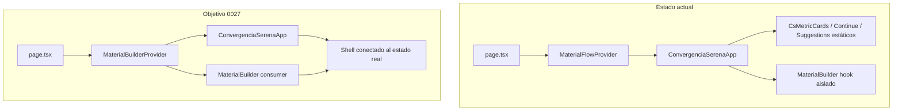

# OpenSpec 0027 — Shell honesto e interacciones reales

## Contexto

Tras completar [0026](openspec/changes/0026-frontend-component-contract-and-visual-regression), el shell Convergencia Serena renderiza correctamente pero varios bloques siguen con **datos hardcodeados** y **controles sin efecto**, tal como muestran las capturas del usuario.

**Decisiones de producto confirmadas:**
- Eliminar el buscador de cabecera por completo.
- Mantener métricas, validación, continuar y sugerencias **siempre visibles**, pero con **estado vacío honesto** (ceros, sin borrador, etc.) hasta que haya progreso real.

## Diagnóstico técnico

| Problema | Causa raíz en código |
|----------|---------------------|
| Buscador inútil | [`CsHeader.tsx`](apps/web/src/components/convergencia-serena/CsHeader.tsx) — `<input>` sin handler ni estado |
| Badges desbordan / confunden con tema | Misma fila `.cs-header-actions` mezcla `.cs-badge`, `.cs-user-chip` y `.cs-button.secondary` del toggle; grid de 3 columnas reservaba espacio al buscador |
| Icono Inicio invisible | [`CsSideRail.tsx`](apps/web/src/components/convergencia-serena/CsSideRail.tsx) + CSS: fondo `--cs-brand` oscuro pero iconos son `` SVG oscuros sin inversión en `[aria-current="page"]` |
| Progreso 66% falso | [`CsMetricCards.tsx`](apps/web/src/components/convergencia-serena/CsMetricCards.tsx) — valores estáticos |
| Validación 126/8/118 falsa + overflow | Mismo archivo + `.cs-three-col` sin bloque vertical por stat |
| Continuar falso / botón muerto | [`CsContinueCard.tsx`](apps/web/src/components/convergencia-serena/CsContinueCard.tsx) — texto mock, `<button>` sin `onClick` |
| Sugerencias mal maquetadas / enlace erróneo | [`CsSuggestionStrip.tsx`](apps/web/src/components/convergencia-serena/CsSuggestionStrip.tsx) — grid plano, `href="#cs-builder"` |
| IA sin feedback perceptible | Estado existe en [`use-material-builder.ts`](apps/web/src/features/material-builder/use-material-builder.ts) pero `message` solo se muestra en [`review-panel.tsx`](apps/web/src/features/material-builder/review-panel.tsx); errores de `/api/ai/plan` no son visibles en el paso de creación |

**Estado real ya disponible pero no conectado:**
- `computeFlowPhase()` y `useMaterialFlow().phase` en [`flow-context.tsx`](apps/web/src/features/material-builder/flow-context.tsx)
- `phaseStatus()` en [`workflow-steps.ts`](apps/web/src/components/convergencia-serena/workflow-steps.ts)
- Builder: `title`, `items`, `material`, `results`, `aiStatus`, `busy`, `message`



## OpenSpec a crear

Nueva change: **`openspec/changes/0027-frontend-shell-honest-state/`**

Archivos siguiendo el patrón de 0026:
- `proposal.md` — problema de datos falsos y controles muertos; valor de confianza UX
- `design.md` — `MaterialBuilderProvider`, fórmulas de métricas, jerarquía visual header, sugerencias contextuales
- `tasks.md` — lista atómica (ver sección inferior)
- `spec.md` — escenarios verificables MUST/SHOULD

**Relación con 0026:** 0026 cubre shell visual; 0027 cubre **veracidad funcional del shell**. No modificar 0026 archivado; actualizar contratos en [`apps/web/src/design-system/component-contracts/`](apps/web/src/design-system/component-contracts/).

---

## 1. Cabecera — eliminar buscador y clarificar jerarquía

**Archivos:** [`CsHeader.tsx`](apps/web/src/components/convergencia-serena/CsHeader.tsx), [`layout.css`](apps/web/src/design-system/css/layout.css), [`components.css`](apps/web/src/design-system/css/components.css), [`responsive.css`](apps/web/src/design-system/css/responsive.css)

- Eliminar bloque `.cs-search` completo (input, kbd, label).
- Cambiar grid header de 3 a **2 columnas**: `auto 1fr` (marca | acciones).
- Separar acciones en dos grupos:
  - `.cs-badge-row` — badges informativos con `role="list"` / `role="listitem"`, **no focusables**
  - `.cs-header-controls` — chip editorial + toggle tema
- Diferenciar visualmente toggle vs badges:
  - Badges: fondo suave, sin cursor pointer, tipografía compacta
  - Toggle: mantener `.cs-button` con borde más marcado, `aria-pressed`, hover/focus visibles
- En viewports estrechos: badges en una fila con `flex-wrap` controlado; controles en fila aparte para evitar el desbordo de la captura

---

## 2. Menú lateral — icono activo visible

**Archivos:** [`components.css`](apps/web/src/design-system/css/components.css), opcionalmente [`CsSideRail.tsx`](apps/web/src/components/convergencia-serena/CsSideRail.tsx)

```css
.cs-nav-link[aria-current="page"] .cs-asset-icon {
  filter: brightness(0) invert(1);
}
.cs-nav-link[aria-current="page"] .cs-icon-box {
  border-color: var(--cs-brand-contrast);
}
```

- Verificar contraste en light y dark theme.
- Hacer `CsSideRail` client component si hace falta resaltar dinámicamente el ítem según hash (`#cs-main`, `#cs-workflow`, etc.) — opcional en esta fase; mínimo arreglar contraste de "Inicio" fijo.

---

## 3. Contexto compartido del builder

**Archivos nuevos/modificados:**
- Nuevo: `apps/web/src/features/material-builder/builder-context.tsx`
- [`page.tsx`](apps/web/src/app/page.tsx) — envolver con `MaterialBuilderProvider`
- [`material-builder.tsx`](apps/web/src/features/material-builder/material-builder.tsx) — consumir contexto en lugar de llamar hook directamente

Patrón:
```tsx
// builder-context.tsx
export function MaterialBuilderProvider({ children }) {
  const builder = useMaterialBuilder();
  return <BuilderContext.Provider value={builder}>{children}</BuilderContext.Provider>;
}
export function useMaterialBuilderContext() { ... }
```

`MaterialFlowProvider` debe envolver o anidar correctamente (el hook ya usa `useMaterialFlow`).

---

## 4. Métricas reales — `CsMetricCards`

**Archivo:** [`CsMetricCards.tsx`](apps/web/src/components/convergencia-serena/CsMetricCards.tsx) → client component

**Nueva util pura:** `apps/web/src/components/convergencia-serena/workspace-metrics.ts`

Fórmulas (5 pasos del flujo):

| Métrica | Cálculo inicial (sin progreso) |
|---------|-------------------------------|
| Completados | `phase` (pasos anteriores al activo) |
| En curso | `1` si `phase < 5`, else `0` |
| Pendientes | `5 - phase - 1` (mín. 0) |
| % donut | `Math.round((phase / 5) * 100)` → **0%** al inicio |
| Elementos totales | `items.length` |
| Por revisar | `material?.status === 'draft' \|\| 'rejected' ? 1 : 0` (MVP sin colecciones persistentes) |
| Correctos | `items.filter(i => i.pictogram).length` |

Texto ejemplo sin progreso: `0 completados · 1 en curso · 4 pendientes` y validación `0 / 0 / 0`.

**CSS overflow:** añadir `.cs-stat-block { display:flex; flex-direction:column; gap:4px; min-width:0; }` y aplicar en cada stat de validación para evitar solapamiento de números serif con labels.

---

## 5. Continuar donde lo dejaste — `CsContinueCard`

**Archivo:** [`CsContinueCard.tsx`](apps/web/src/components/convergencia-serena/CsContinueCard.tsx) → client component

Estado honesto sin progreso:
- Título: **"Sin borrador activo"**
- Subtítulo: **"0 de 5 pasos completados"**
- Botón **"Continuar"** habilitado pero con acción real: `scrollIntoView` de `#cs-builder` + `focus` en `#material-title`

Con progreso:
- Título: `title.trim()` o `material?.title` si existe
- Subtítulo: `{phase} de 5 pasos completados`
- Misma acción de scroll/focus

Añadir `aria-disabled` visual si no hay nada que retomar más allá del scroll (opcional: texto del botón "Ir al área de trabajo").

---

## 6. Sugerencias contextuales — `CsSuggestionStrip`

**Archivo:** [`CsSuggestionStrip.tsx`](apps/web/src/components/convergencia-serena/CsSuggestionStrip.tsx)

- Nueva clase `.cs-suggestion-grid` (2×2 desktop, 1 col mobile) con `.cs-suggestion-card`:
  - icono/ilustración arriba
  - `gap` fijo entre icono y título (mín. 12px)
  - subtítulo con `.cs-metric-label`
- Derivar 4 sugerencias desde `workflowSteps` + `phase` (siguiente paso recomendado, búsqueda manual, revisión accesibilidad, ayuda contextual).
- Cada tarjeta: `<a href="#...">` a anclas reales (`#cs-builder`, `#cs-workflow`, `#crear`, `#cs-review`, `#cs-accessibility`).
- **"Ver todas →"** → `href="#cs-suggestions"` (id en la propia sección) con scroll suave; **no** enlazar a `#cs-builder`.
- Textos sin claims falsos ("colecciones populares", "lo más usado esta semana") — sustituir por guías accionables alineadas con el flujo real.

---

## 7. Asistente IA — feedback visible

**Archivos:** [`creation-form.tsx`](apps/web/src/features/material-builder/creation-form.tsx), [`use-material-builder.ts`](apps/web/src/features/material-builder/use-material-builder.ts), [`components.css`](apps/web/src/design-system/css/components.css) o estilos embedded

- Mostrar `message` con `role="status"` y `aria-live="polite"` **dentro** de la sección IA (no solo en review).
- Botón "Generar propuesta textual": texto dinámico `busy ? "Generando propuesta…" : "Generar propuesta textual"`.
- Si `aiStatus === null`: spinner o texto "Comprobando conexión con el servidor…".
- Si fetch de status falla: banner visible con motivo (`aiStatus.reason`) y enlace de ayuda a `GET /backend/api/ai/status`.
- Tras error en `generateAIPlan`: mantener error en la misma sección.
- Verificar en Docker que `.env` con `AI_PROVIDER=openai` y `OPENAI_API_KEY` llega al servicio `api` ([`docker-compose.yml`](docker-compose.yml) ya mapea variables); documentar en README breve nota de diagnóstico si `available: false`.

**Sin cambios de backend** salvo que tests revelen bug real en proxy (el proxy [`route.ts`](apps/web/src/app/backend/[...path]/route.ts) ya apunta a `http://api:8000`).

---

## 8. Tests y regresión visual

| Tipo | Archivo | Qué validar |
|------|---------|-------------|
| Unit | `workspace-metrics.test.ts` | Ceros al inicio; progreso al subir `phase` |
| Unit | `CsMetricCards.test.tsx` | Render 0%, labels sin mock |
| Unit | `CsContinueCard.test.tsx` | Texto vacío + click hace scroll (mock) |
| Unit | `CsHeader.test.tsx` | Ausencia de input búsqueda |
| Unit | `material-builder.test.tsx` | Mensaje IA visible en embedded |
| E2E | [`convergencia-serena.visual.spec.ts`](apps/web/tests/e2e/convergencia-serena.visual.spec.ts) | Regenerar snapshots tras cambio header/métricas/sugerencias |
| E2E | Nuevo `convergencia-serena.honest-state.spec.ts` | 0% inicial, continuar navega a builder, sugerencias no van a builder con "ver todas" |
| A11y | Mantener axe en visual spec | Sin regresiones |

---

## 9. Contratos y documentación

Actualizar:
- [`CsHeader.md`](apps/web/src/design-system/component-contracts/CsHeader.md) — sin buscador; badges no interactivos
- [`CsMetricCards.md`](apps/web/src/design-system/component-contracts/CsMetricCards.md) — datos derivados del builder
- [`CsContinueCard.md`](apps/web/src/design-system/component-contracts/CsContinueCard.md) — estado vacío + acción scroll
- [`CsSuggestionStrip.md`](apps/web/src/design-system/component-contracts/CsSuggestionStrip.md) — layout grid + anclas reales
- [`CsSideRail.md`](apps/web/src/design-system/component-contracts/CsSideRail.md) — contraste icono activo

---

## Criterios de aceptación (spec.md)

**MUST:**
- Sin input de búsqueda en cabecera.
- Métricas muestran 0% y contadores en cero sin progreso.
- Validación muestra 0/0/0 sin items.
- Continuar muestra estado vacío honesto y navega al builder al pulsar.
- Sugerencias con espaciado consistente; "Ver todas" no apunta a `#cs-builder`.
- Icono de Inicio visible con item activo.
- Toggle tema visualmente distinguible de badges.
- Sección IA muestra estado de servidor, carga y errores en el paso de creación.

**MUST NOT:**
- Mostrar porcentajes o colecciones inventadas.
- Introducir datos personales o colecciones persistentes falsas.

---

## Orden de implementación recomendado

1. OpenSpec 0027 (proposal → design → tasks → spec) + `make openspec-verify`
2. `MaterialBuilderProvider` (desbloquea métricas/continuar/sugerencias)
3. CSS fixes (header, nav activo, stats, sugerencias)
4. Componentes shell conectados
5. Feedback IA en creation-form
6. Tests + snapshots + verificación Docker con IA
